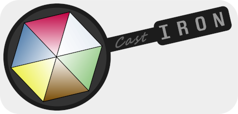

# The CastIron Magic Engine
CastIron is a game logic engine designed to facilitate complex interactions between the actors and environment of a game world. It currently supports 2D, hex-grid-based games, though support for 3D and arbitrary coordinate systems is planned for a (far) future release.

Note that CastIron is first and foremost a, "teach myself Rust"-tier project. So if you are irresponsible enough to actually use this thing, you are firmly on your own when your PC explodes and your girlfriend leaves you for a more stable homelife.

## Sample Application
[Sand Casting](https://github.com/cjm571/sand_casting) is a sample "game" that leverages all of the features of the CastIron engine. It can be used as a reference for CastIron functionality, or even played in desperate times.